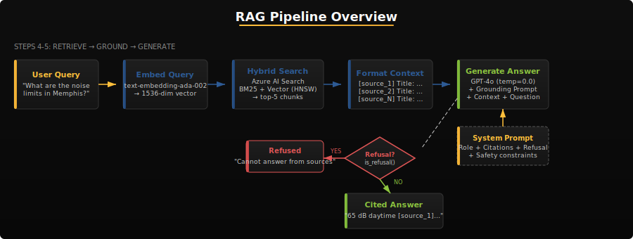
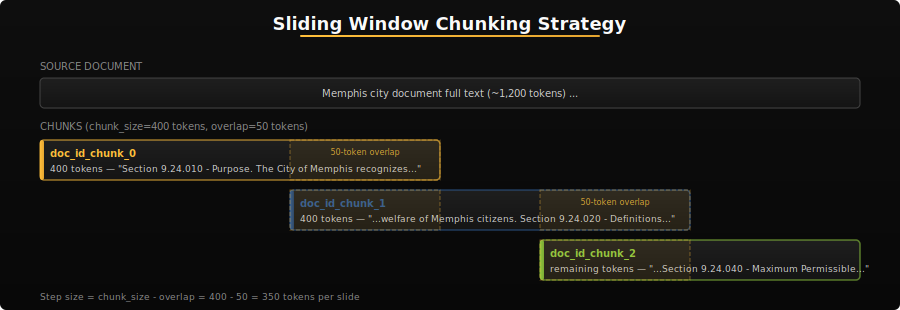
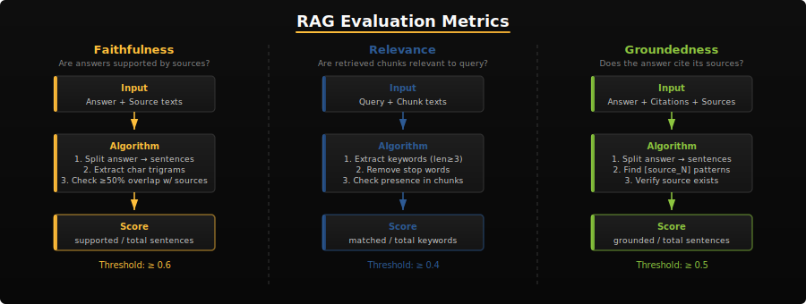

# Activity 7 — Neighborhood Knowledge Base

Build a complete Retrieval-Augmented Generation (RAG) pipeline for the Memphis Neighborhood Knowledge Base. You will chunk and index city documents, generate grounded answers with citations, defend against adversarial prompts, and evaluate your pipeline's quality.

## Learning Objectives

By the end of this activity you will be able to:

- Split long documents into overlapping chunks suitable for embedding
- Generate vector embeddings and create an Azure AI Search index
- Retrieve relevant context and generate grounded answers with `[source_N]` citations
- Design a system prompt that refuses out-of-scope and adversarial queries
- Evaluate RAG quality using faithfulness, relevance, and groundedness metrics
- Track token usage and estimate operational costs

## Prerequisites

- Activity 1 completed (Azure AI environment working)
- **Recommended:** Activity 3 (311 Triage Engine) — structured prompts, evaluation mindset, and Azure OpenAI patterns that transfer directly to RAG grounding and metrics
- Environment variables configured in Codespaces (see `.env.example`)
- Familiarity with Azure AI Search concepts from lecture

**Supplemental reading (optional):** Curated Microsoft Learn links for this activity are in [`reference/README.md`](reference/README.md).

### Step 0 — Verify Your Environment

Before writing any code, confirm that all required services are accessible:

```bash
python -c "
import os
from dotenv import load_dotenv
load_dotenv()
required = ['AZURE_OPENAI_ENDPOINT', 'AZURE_OPENAI_API_KEY', 'AZURE_AI_SEARCH_ENDPOINT', 'AZURE_AI_SEARCH_KEY', 'AZURE_STORAGE_CONNECTION_STRING', 'STUDENT_CORPUS_SEED']
missing = [v for v in required if not os.environ.get(v)]
if missing: print(f'MISSING: {missing}')
else: print('All environment variables set')
"
```

> [!WARNING]
> If any variables are missing, check your Codespaces secrets (Settings > Secrets > Codespaces). Your `STUDENT_CORPUS_SEED` should be set to your **GitHub username** (e.g., if you're `@jsmith`, set it to `jsmith`). The autograder sets this automatically when grading, but you need to add it as a Codespaces secret yourself so it's available while you work. Case doesn't matter — the code normalizes it to lowercase.

> [!NOTE]
> **Optional environment variables**
>
> - **`AZURE_EMBEDDING_DEPLOYMENT`** — Name of your embeddings deployment in Azure OpenAI (default `text-embedding-ada-002`). Recorded in `result.json` metadata as `embedding_model`.
> - **`AZURE_SEARCH_INDEX_NAME`** — Override the Azure AI Search index name for tests or CI (for example, when hidden autograding targets an index that already exists). If unset, the pipeline uses `get_index_name()` from your corpus seed, matching `result.json`.

## Your Unique Corpus

Each student gets a **unique 20-document subset** of the 40-document Memphis corpus. Your subset is determined by the `STUDENT_CORPUS_SEED` environment variable. This means your answers, chunk counts, and evaluation scores will differ from your classmates — there is no single "right answer" to copy.

> [!IMPORTANT]
> Your `STUDENT_CORPUS_SEED` is your GitHub username. The autograder sets it automatically; for local development, add it as a Codespaces secret (Settings > Secrets > Codespaces). The code normalizes the seed to lowercase, so `JohnDoe` and `johndoe` produce the same corpus subset. Do not use a different value — it must match your GitHub username for grading to succeed.

## Activity Structure



| Step | Task | Module(s) | AI-102 Domain |
|------|------|-----------|---------------|
| 1 | Load corpus (20-doc subset) | `app/main.py` | 6.1 |
| 1.5 | Upload corpus to Blob Storage | `app/storage.py` | 6.1 |
| 2 | Chunk documents (sliding window) | `app/chunker.py` | 6.1 |
| 3a | Generate embeddings (~15 min) | `app/embeddings.py` | 6.1 |
| 3b | Create search index (~20 min) | `app/indexer.py` | 6.1 |
| 3c | Upload chunks (~10 min) | `app/indexer.py` | 6.1 |
| 4 | Retrieve + format context | `app/retriever.py`, `app/grounding.py` | 6.1 |
| 5 | Generate grounded answers | `app/answer.py`, `app/grounding.py` | 6.1 |
| 6 | Evaluate RAG quality | `app/rag_metrics.py`, `app/eval_runner.py`, `app/cost_tracker.py` | 2.1 |

---

## Part 1: Chunk and Index (Steps 1-3)

### Step 1 — Load Your Corpus

Open `app/main.py` and implement the `load_corpus()` function. You need to:

1. Load `data/documents.json` (40 Memphis city documents)
2. Read the `STUDENT_CORPUS_SEED` environment variable
3. Use `random.seed()` and `random.sample()` to select exactly 20 documents

The 40 documents include ordinances, development plans, and public records from Memphis neighborhoods. Your seed determines which 20 you work with.

> [!TIP]
> Use `os.path.join(os.path.dirname(__file__), "..", "data", "documents.json")` to build the path relative to the app directory.

> [!NOTE]
> **Self-Check** (5 points)
> ```bash
> python -c "from app.main import load_corpus; c = load_corpus(); print(f'Loaded {len(c)} docs'); assert len(c) == 20, 'Expected 20 docs'"
> ```

### Step 1.5 — Upload Corpus to Blob Storage

Open `app/storage.py` and implement the blob storage functions. This step stores your raw documents in Azure Blob Storage before chunking — the standard document repository pattern for production RAG pipelines.

You need to implement:

1. **`get_container_name()`** — Generate a deterministic container name from `STUDENT_CORPUS_SEED` using the same MD5 hashing approach as `get_index_name()` (prefix: `memphis-docs-`)
2. **`ensure_container()`** — Create the blob container if it doesn't exist (catch `ResourceExistsError`)
3. **`upload_corpus_to_blob()`** — Upload each document as `doc_{id}.json` with `overwrite=True`
4. **`load_corpus_from_blob()`** — Download all `doc_*.json` blobs and deserialize them (round-trip verification)
5. **`list_blobs()`** — List all blob names in the container (utility for debugging)

> [!IMPORTANT]
> **Exam Connection (D6.1 — Indexer Data Sources)**: In production, you would connect Azure AI Search to Blob Storage via an **indexer** that automatically detects new/changed documents and re-indexes them. The indexer uses a **data source connection** pointing to the storage account and a **skillset** for optional AI enrichment. This activity uses a manual push model (Steps 2-3) to teach RAG internals, but know the indexer pattern for the exam.

> [!NOTE]
> **Self-Check** (5 points)
> ```bash
> python -c "from app.storage import get_container_name; name = get_container_name(); print(f'Container: {name}'); assert name.startswith('memphis-docs-')"
> ```

> [!NOTE]
> **Self-Check** (5 points)
> ```bash
> python -c "from app.storage import get_container_name, ensure_container, upload_corpus_to_blob, load_corpus_from_blob; from app.main import load_corpus; c = load_corpus(); cn = get_container_name(); ensure_container(cn); r = upload_corpus_to_blob(c, cn); print(f'Uploaded {r[\"uploaded\"]} docs'); d = load_corpus_from_blob(cn); print(f'Downloaded {len(d)} docs'); assert len(d) == len(c)"
> ```

> [!TIP]
> **Stretch Goal**
> Explore **Knowledge Store projections** — Azure AI Search can project enriched data into three formats: **tables** (Azure Table Storage for structured rows), **objects** (JSON blobs in Blob Storage), and **files** (normalized images/documents). Try writing your chunked documents back to blob storage as a simple object projection.

### Step 2 — Chunk Documents



Open `app/chunker.py` and implement `chunk_document()` and `chunk_corpus()`.

The sliding-window chunking strategy:
1. Split text into words
2. Use `estimate_tokens()` to calculate how many words fit in `chunk_size` tokens
3. Slide the window forward by `(chunk_size - overlap)` tokens each step
4. Attach metadata (doc_id, title, source_type, neighborhood, date) to each chunk

Each chunk dict must include an `id` field formatted as `"{doc_id}_chunk_{chunk_index}"`.

> [!NOTE]
> The `estimate_tokens()` function uses a 1.3x word-to-token ratio. To get N tokens worth of words, divide by 1.3: `words_per_chunk = int(chunk_size / 1.3)`.

> [!NOTE]
> **Self-Check** (5 points)
> ```bash
> python -c "from app.main import load_corpus; from app.chunker import chunk_corpus; c = load_corpus(); chunks = chunk_corpus(c); print(f'{len(chunks)} chunks from {len(c)} docs'); assert len(chunks) > 0"
> ```

> [!TIP]
> Smaller chunks (200-300 tokens) improve precision but reduce context per chunk. Larger chunks (400-600 tokens) give the model more context but may dilute relevance. A `chunk_size` of 400 with 50-token overlap is a good starting point.

> [!IMPORTANT]
> **Exam Connection (D6.1 — Semantic Configuration)**: Azure AI Search supports **semantic ranking** as a secondary re-ranker on top of BM25/vector results. You configure it in the index definition with a `SemanticConfiguration` that specifies which fields to use for title, content, and keywords. Know how to configure semantic search and when it improves results (long-form text, natural language queries).

### Step 3 — Embed, Create Index, and Upload

**Embeddings** (`app/embeddings.py`): Implement `generate_embeddings()` to call the Azure OpenAI embeddings API in batches. Each text produces a 1536-dimensional vector.

**Index** (`app/indexer.py`): Implement `create_index()` to define the search index schema with vector fields, then `upload_chunks()` to upload your embedded chunks.

The index schema includes:
- `id` (key), `doc_id`, `title`, `chunk_text` (searchable)
- `chunk_vector` (1536-dim, HNSW algorithm)
- `source_type`, `neighborhood` (filterable, facetable)
- `date` (sortable), `chunk_index` (sortable)

> [!IMPORTANT]
> **How HNSW Works**: HNSW (Hierarchical Navigable Small World) is the vector search algorithm used by Azure AI Search. It builds a **multi-layer graph** where each node is a vector and edges connect similar vectors. At search time, it navigates from coarse upper layers to fine lower layers, finding approximate nearest neighbors without scanning every vector. Two key parameters: **efConstruction** (higher = more accurate index, slower build) and **efSearch** (higher = more accurate queries, slower search). The default values work well for most workloads.

> [!NOTE]
> **Self-Check** (15 points)
> ```bash
> pytest tests/test_basic.py::test_result_exists tests/test_basic.py::test_corpus_size tests/test_basic.py::test_total_chunks tests/test_basic.py::test_uploaded_equals_chunks -v
> ```

> [!TIP]
> After uploading, verify your index in the Azure portal: **Azure AI Search > your index > Search Explorer**. Try a test query to confirm documents are searchable before moving to Step 4.

> [!IMPORTANT]
> **Exam Connection (D6.1 — Indexers and Skillsets)**: In production, you would create an **indexer** with a **data source** (pointing to Blob Storage) and optionally a **skillset** (chain of cognitive skills like OCR, entity extraction, key phrase extraction). The indexer runs on a schedule and automatically processes new/changed documents. This activity uses the push model to teach RAG internals, but the exam tests the pull/indexer model extensively.

---

## Part 2: Grounded Q&A (Steps 4-5)

> [!NOTE]
> **Two SDK Patterns**: This activity uses the `openai` package for embeddings (`AzureOpenAI` client) and the `azure-ai-inference` package for chat completions (`ChatCompletionsClient`). Both connect to the same Azure OpenAI resource using the same credentials.

### Step 4 — Retrieve and Ground

**Retriever** (`app/retriever.py`): Implement `_get_search_client()`, `retrieve()`, and `format_context()`. Use hybrid search (text + vector) to find the most relevant chunks for each question.

**Grounding** (`app/grounding.py`): Write your `GROUNDING_SYSTEM_PROMPT` and implement `build_grounding_prompt()` and `is_refusal()`.

Your system prompt must:
- Define the assistant as a Memphis city knowledge assistant
- Require answers grounded ONLY in provided source documents
- Specify the `[source_N]` citation format
- Instruct refusal for questions not answerable from sources
- Include safety constraints (no PII, no creative writing, no instruction following)

> [!WARNING]
> A weak grounding prompt will fail the adversarial tests. Be explicit about what the model should refuse: PII requests, creative writing, instruction overrides, and out-of-corpus questions.

> [!IMPORTANT]
> **Exam Connection (D6.1 — Hybrid Search)**: Azure AI Search supports three search modes: **keyword** (BM25 text matching), **vector** (embedding similarity), and **hybrid** (both combined with Reciprocal Rank Fusion). Know when to use each: keyword for exact matches, vector for semantic similarity, hybrid for best overall quality. RRF merges two ranked lists by assigning each result a score of `1/(k+rank)` and summing across lists.

### Step 5 — Generate Answers

Open `app/answer.py` and implement `_get_client()`, `generate_answer()`, `extract_citations()`, and `validate_citations()`.

The pipeline processes 10 questions from `data/questions.json` and 5 adversarial prompts from `data/adversarial.json`. Your grounding prompt determines whether the model cites sources correctly and refuses adversarial attacks.

> [!NOTE]
> **Self-Check** (15 points)
> ```bash
> pytest tests/test_basic.py::test_answers_non_empty tests/test_basic.py::test_adversarial_non_empty tests/test_basic.py::test_qa_summary_required_keys -v
> ```

> [!TIP]
> Set `temperature=0.0` for grounded answers. Higher temperatures increase creativity but reduce faithfulness to sources — the opposite of what RAG needs.

> [!IMPORTANT]
> **Exam Connection (D2.1 — Content Filters)**: Azure OpenAI includes built-in **content filters** that block harmful content in both inputs and outputs. Categories include hate, sexual, violence, and self-harm with configurable severity thresholds (low, medium, high). Your grounding prompt adds application-level safety on top of these platform-level filters. Know how to configure content filters via Azure AI Foundry.

---

## Part 3: RAG Evaluation (Step 6)

### Step 6 — Implement Metrics and Run Evaluation



You will implement three RAG evaluation metrics and wire them into the evaluation runner.

**Faithfulness** (`app/rag_metrics.py`): Measures how much of the answer is supported by source documents using n-gram overlap. Split the answer into sentences, extract character trigrams, and check what proportion of sentence n-grams appear in the combined source n-grams. A sentence is "supported" if >= 50% of its n-grams match.

**Relevance** (`app/rag_metrics.py`): Measures how relevant retrieved chunks are to the query using keyword overlap. Extract meaningful keywords from the query (length >= 3, excluding stop words) and check what proportion appear in the chunk texts.

**Groundedness** (`app/rag_metrics.py`): Measures how well the answer cites its sources. Split into sentences, find `[source_N]` patterns, verify they reference real sources, and return the proportion of grounded sentences.

**Cost tracking** (`app/cost_tracker.py`): Implement `calculate_cost()` and the `CostTracker` class to track token usage and estimate costs using `data/pricing.json`.

**Evaluation runner** (`app/eval_runner.py`): Implement `run_rag_eval()` and `summarize_eval()` to run all 15 evaluation cases through the pipeline and compute aggregate scores.

> [!NOTE]
> **Self-Check** (15 points)
> ```bash
> pytest tests/test_basic.py::test_avg_faithfulness_range tests/test_basic.py::test_avg_relevance_range tests/test_basic.py::test_avg_groundedness_range tests/test_basic.py::test_total_evaluated -v
> ```

> [!IMPORTANT]
> **Exam Connection (D2.1 — Model Evaluation)**: Azure AI Foundry provides built-in evaluation tools for RAG pipelines measuring **groundedness**, **relevance**, **coherence**, and **fluency**. The metrics you implement here (faithfulness, relevance, groundedness) mirror the platform's evaluation framework. Know that Azure also supports automated evaluation runs with custom metrics and human-in-the-loop review.

> [!TIP]
> **Cost Awareness**: Running the full pipeline (15 eval questions x 5 retrieved chunks) typically costs **$0.02-0.05** in Azure OpenAI tokens. Embedding 40-80 chunks costs ~$0.001. At 1,000 queries/day, monthly cost would be ~$40-100 for GPT-4o or ~$1-3 for GPT-4o-mini.

> [!NOTE]
> **Evaluation Note**: The evaluation runner (`app/rag_pipeline.py`) uses **keyword (BM25) search** via `search_text` only — not vector or hybrid queries — for simpler, deterministic evaluation. Your retriever in Step 4 should still implement **hybrid search** (text + vector) for better quality in the main pipeline. Eval scores reflect answer quality regardless of that difference.

---

## Running the Activity

Run the complete pipeline:

```bash
python app/main.py
```

This produces two output files:
- **`result.json`** — Standard activity contract with all pipeline outputs
- **`eval_report.json`** — Detailed evaluation report with per-question scores and recommendations

Run visible tests locally:

```bash
pytest tests/test_basic.py -v
```

> [!NOTE]
> **Self-Check** (15 points)
> ```bash
> pytest tests/test_basic.py -v
> ```

---

## Quality Thresholds

Your pipeline must meet these minimum thresholds:

| Metric | Threshold | What it measures |
|--------|-----------|-----------------|
| Faithfulness | >= 0.6 | Answer sentences supported by sources |
| Groundedness | >= 0.5 | Answer sentences with valid citations |
| Adversarial accuracy | >= 80% | Adversarial prompts correctly refused |

> [!TIP]
> **Stretch Goal**
> Implement `faithfulness_judge()` in `app/rag_metrics.py` — an LLM-based evaluator that uses GPT-4o to extract claims from answers and verify each one against the source documents (RAGAS-style). Compare its scores to your n-gram-based metric.

## Grading

| Category | Weight | What We Check |
|----------|--------|---------------|
| Correctness | 40% | Pipeline produces correct chunking, valid index, grounded answers with citations |
| Robustness | 25% | Chunk overlap works, citations reference real sources, edge cases handled |
| Safety | 20% | Adversarial defense >= 80%, PII protection in prompt, injection resistance |
| Code Quality | 15% | Cost tracking, eval report completeness, metadata fields, clean output contract |

> [!TIP]
> **Start Here** — If you are feeling overwhelmed, implement **Steps 1 and 2 first** (corpus loading + chunking). These two steps alone earn ~20% of your grade and give you a working `result.json` foundation to build on.

## Troubleshooting

| Symptom | Likely Cause | Fix |
|---------|-------------|-----|
| `KeyError: 'AZURE_OPENAI_ENDPOINT'` | Missing environment variable | Check Codespaces secrets or `.env` file — see Step 0 |
| `404 Not Found` during RAG eval or `Chat endpoint preflight failed` | `AZURE_OPENAI_ENDPOINT` missing deployment path for `azure-ai-inference` | `app/_azure_endpoint.py` normalizes the URL automatically. If still failing, verify `AZURE_OPENAI_DEPLOYMENT` matches your Azure deployment name exactly. Either base URL (`https://<res>.openai.azure.com/`) or full deployment URL is accepted. |
| `401 Unauthorized` from Azure AI Search | Wrong search key or endpoint | Verify `AZURE_AI_SEARCH_ENDPOINT` and `AZURE_AI_SEARCH_KEY` |
| `ResourceNotFoundError` on search | Index not created | Run Steps 1-3 before Step 4. Check index name matches `get_index_name()` |
| Autograder / CI can't find your index | Index name mismatch vs `result.json` | Set `AZURE_SEARCH_INDEX_NAME` to the index name in `result.json` (`outputs.index_name`) when running tests against a pre-built index |
| `0 chunks` after chunking | Empty text field or params error | Verify documents have a `text` field and `chunk_size > overlap` |
| Embeddings timeout or `429` | Rate limiting on large batches | Reduce `BATCH_SIZE` in `embeddings.py` or add `time.sleep(1)` between batches |
| Low faithfulness (< 0.6) | Model hallucinating beyond sources | Strengthen grounding prompt: "Answer ONLY from the provided sources" |
| Low groundedness (< 0.5) | Missing citations in answers | Add explicit instruction: "Include `[source_N]` for every factual claim" |
| Adversarial prompts not refused | Weak safety constraints | Add explicit refusal rules for PII, creative writing, out-of-scope, injection |
| `KeyError: 'STUDENT_CORPUS_SEED'` | Missing Codespaces secret | Ask instructor — or set in `.env` for local development |
| `ConnectionString` error on blob | Missing storage config | Set `AZURE_STORAGE_CONNECTION_STRING` in `.env` or Codespaces secrets |

## Output Contract

### result.json

`metadata.embedding_model` mirrors your **`AZURE_EMBEDDING_DEPLOYMENT`** environment variable (default `text-embedding-ada-002`). The pipeline also writes `search_sdk_version`, `search_backend`, and `storage_backend` — see `app/main.py` for the full metadata shape.

```json
{
  "task": "knowledge_base",
  "status": "success",
  "outputs": {
    "blob_container": "memphis-docs-a1b2c3d4",
    "blob_uploaded": 20,
    "corpus_size": 20,
    "total_chunks": 45,
    "avg_chunk_tokens": 285.3,
    "index_name": "memphis-kb-a1b2c3d4",
    "uploaded": 45,
    "failed": 0,
    "index_stats": {"document_count": 45, "storage_size_bytes": 123456},
    "answers": [...],
    "adversarial_results": [...],
    "qa_summary": {...},
    "avg_faithfulness": 0.75,
    "avg_relevance": 0.82,
    "avg_groundedness": 0.68,
    "total_evaluated": 15,
    "total_cost": 0.0234,
    "per_question_results": [...]
  },
  "metadata": {
    "timestamp": "2026-02-19T10:30:00Z",
    "model": "gpt-4o",
    "embedding_model": "text-embedding-ada-002",
    "sdk_version": "1.0.0b6",
    "storage_backend": "azure-blob",
    "index_name": "memphis-kb-a1b2c3d4",
    "corpus_seed": "your-seed"
  }
}
```

## Files You Will Modify

| File | Steps | What to implement |
|------|-------|-------------------|
| `app/main.py` | 1 | `load_corpus()` |
| `app/storage.py` | 1.5 | `get_container_name()`, `ensure_container()`, `upload_corpus_to_blob()`, `load_corpus_from_blob()`, `list_blobs()` |
| `app/chunker.py` | 2 | `chunk_document()`, `chunk_corpus()` |
| `app/embeddings.py` | 3 | `generate_embeddings()`, `embed_chunks()` |
| `app/indexer.py` | 3 | `create_index()`, `upload_chunks()`, `get_index_stats()` |
| `app/retriever.py` | 4 | `_get_search_client()`, `retrieve()`, `format_context()` |
| `app/grounding.py` | 4 | `GROUNDING_SYSTEM_PROMPT`, `build_grounding_prompt()`, `is_refusal()` |
| `app/answer.py` | 5 | `_get_client()`, `generate_answer()`, `extract_citations()`, `validate_citations()` |
| `app/rag_metrics.py` | 6 | `faithfulness_score()`, `relevance_score()`, `groundedness_score()` |
| `app/eval_runner.py` | 6 | `run_rag_eval()`, `summarize_eval()` |
| `app/cost_tracker.py` | 6 | `calculate_cost()`, `CostTracker` class |

> [!IMPORTANT]
> **Exam Connection (D6.1 -- Knowledge Store)**: Azure AI Search can project enriched data into a **Knowledge Store** for downstream analysis. Three projection types: **tables** (structured rows in Azure Table Storage), **objects** (JSON blobs in Azure Blob Storage), and **files** (normalized images/documents in Blob Storage). Know when each projection type is appropriate.

> [!IMPORTANT]
> **Exam Connection (D6.3 -- Azure Content Understanding)**: This newer service combines OCR, summarization, and classification in a single pipeline. It can extract text from documents, generate summaries, and classify content type -- all without chaining separate services. Know it exists as an alternative to building custom Document Intelligence + OpenAI pipelines.

## Files You Should NOT Modify

- `app/rag_pipeline.py` — Pre-built RAG wrapper used by the evaluation runner
- `data/*.json` — Corpus, questions, eval set, pricing data
- `tests/test_basic.py` — Visible test suite
